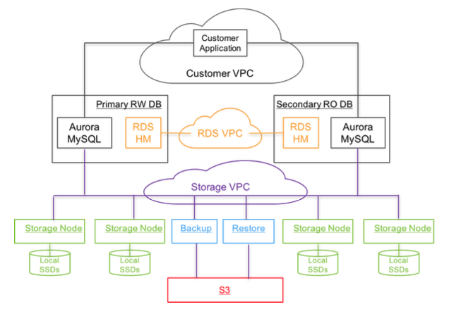

# 五彩极光欧若拉 

> 神秘北极圈 阿拉斯加的山巅

## Overview

Aurora 是亚麻的一款云原生的 OLTP 关系型数据库。2015年7月 Aurora 完成 GA（General Available）。2017年亚麻发表论文 Amazon Aurora: Design Considerations for High Throughput Cloud-Native Relational Databases 描述了一些设计原理和实现细节。 

Aurora 把传统单机数据库（比如 MySQL）拆成了计算和存储两个部分。计算层都是无状态的节点（挂了重新拉一个起来，scale up/down 也很方便），而且可以复用 MySQL 的大部分代码逻辑（优化器、执行器、事务等等）。存储层从本地磁盘换成了一个分布式、高可用、可扩展的存储服务（一份数据复制给多个存储节点，提供 higher durability, availability, IOPS and reduction of jitter)，分离出分储层还能带来更好的 crash recovery 和 backup/restore。计算层通过网络往存储层写 log（而不是 data），存储层把 log 转化为 data。作者认为实现高吞吐的瓶颈在于网络，而写 log 的设计能大幅降低网络开销。

## Quorum Model

Aurora 的存储层用了 quorum-based voting protocol 来面对各种失败（网络断了，磁盘坏了，机房被淹）。假设有 V 个节点，读操作需要收到 V_r 个节点的回复才能完全，写操作要收到 V_w 个节点的回复才能完成。为了保证读操作能读到最新的写入，必须有 V_r + V_w > V。为了避免写冲突，必须有 V_w > V/2。如果要容忍一个节点的失败，一般配置是 V = 3，V_w = 2，V_r = 2。但 Aurora 觉得这种程度的 durability 和 availability 不行。假设一共有 3 个 AZ（Availability Zone），每个 AZ 一个节点，然后每个 AZ 会有 continuous low level background noise of node, disk and network path failures（我猜大概就是磁盘网络偶尔会抽风出点毛病）。假设一个 AZ 着火或者被淹了，剩下两个 AZ 中的某一个偶发抽风一下，服务就不可用了（我们不知道剩下那个节点是否有最新的数据）。Aurora 想要容忍 AZ + 1 个节点的失败（某个 AZ 里的节点全挂了加上另一个 AZ 中一个节点挂了），就设计成如下的配置：3 个 AZ，每个 AZ 两个节点的，V = 6，V_w = 4，V_r = 3。

1. 如果一个 AZ 挂了加上另外一个 AZ 中的一个节点挂了（一共 3 个节点挂了），这时候没法写，但可以读，通过 quorum read 可以确认最新的数据，然后把最新数据拷贝到一个新的节点来让写恢复。
2. 如果 2 个节点挂了（一个 AZ 挂了或者属于不同 AZ 的 2 个节点挂了），读写都还可以继续进行。

Note：
1. 不太清楚跨 AZ 流量贵吗。然后 latency 会高吗。写操作要收到 4 个回复，肯定有跨 AZ 的。
2. 不太说得上来 quorum 和 paxos/raft 的本质区别在哪里，设计存储产品的时候该用哪一个。quorum 只保证了读可见最新的写、没有写岔（不同节点对最新值达成共识），然后 quorum 是无主的。paxos/raft 能保证操作有一个全局的顺序。感觉 TiKV 和 Cassandra/Dynamo 是差不多的产品（存疑），但前者用了 raft，后两者用了 quorum，在产品形态上会带来什么差异吗。
3. a failure in durability can be modeled as a long-lasting availability event, and an availability event can be modeled as a long-lasting performance variation。没理解这句啥意思。

当一个节点出现故障的时候，我们希望尽快修复它，避免屋漏偏逢连夜雨。但如果一个节点的数据量很大，修起来就比较慢。所以 Aurora 也做了分片的操作。数据会切分成 10GB 大小的 segment，然后每个 PG（Protection Group）由 6 个 segment 组成。10GB 的 segment 出故障的时候修起来快多了（10Gbps 网络下只需要 10s 左右）。感觉这里的修法就是卸载坏的盘，然后从其他副本把最新数据拷贝到新盘上然后挂载到这个节点上。

在这种设计下，有个节点暂时慢了甚至不可用，对整体没太啥影响，Aurora 利用这点来做一些运维操作。比如某个节点过热要换掉、要升级或者打补丁，都可以直接操作这个节点，暂时不可用没啥问题。

## Log Is Database

首先，作者展示了 MySQL 要达到 AZ + 1 的容错需要配置成什么样（具体细节可以参考 [mit6.824 aurora notes](https://pdos.csail.mit.edu/6.824/notes/l-aurora.txt)）。

但这里我有疑惑：

1. 感觉这图上很多箭头可以优化掉。至少两个 instance 之间同步只传 binlog 就行吧。
2. 文章里说 steps 1, 3, and 5 are sequential and synchronous 不太理解。[mit6.824 aurora notes](https://pdos.csail.mit.edu/6.824/notes/l-aurora.txt) 的说法似乎更合理一些：要达到 AZ + 1 的容错，DB write has to wait for all four EBS replicas to respond。

在 MySQL 里，写路径是先写 redo log，然后再 apply redo log 去写对应的 page（如果 page 在 buffer cache 里直接写，没在的话先读到 cache 再写，然后会把 dirty page 再 flush 到磁盘）。这个过程只有写 redo log 是同步的，apply redo log 写对应的 page 可以异步做。Aurora 改造了这个流程。计算层只要通过网络把 redo log 写到存储层就可以回应客户端，然后由存储层担任 redo log applicator 的角色。Apply redo log（也就是 page materialization）可以在存储层后台持续异步执行，甚至在没有读请求的时候可以不 page materialization。

Note：
1. 有两种方法。第一种是计算层传 redo log 给 6 个存储节点，做 6 次 apply redo log。这种方案网络开销少，但重复 6 次 apply redo log 产生了 6 份 cpu 开销（mem 和 io 开销不太会算）。Aurora 的存储节点可以 scale out，所以用增加 cpu 开销（分片后多节点均摊）来减少网络数据传输（网络是瓶颈）。第二种是计算层做一次 apply redo log，把 dirty page 发给 6 个存储节点。这种方案网络开销大，但能避免重复的 apply redo log 减少 cpu 开销。印象里某次听讲座听到 PolarDB 好像用了第二种方案（不太记得请了，也可能我在做梦），用了 RDMA 之类的高性能网络让网络不再成为瓶颈。

从图中可以看出，Aurora 的计算层只有一个 primary instance 可以支持读写操作，其他 replica instance 只支持低延迟的读操作。因此计算层只有一个 primary instance 会往存储层写 redo log。注意这里是 quorum write。也就是说写 redo log 到 6 个存储节点，只要收到 4 个存储节点回应，就可以向客户端回应。相比于上一张图 MySQL 需要 4 个 EBS 都回应，6 个里 4 个回应的延迟应该会好一些。就像你需要集齐 4 封推荐信，邀请 6 个教授写推荐信比只邀请 4 个教授能更快集齐。因为有两个存储节点可以晚点回复，所以存储层在做一些 background 操作（比如 backup/restore）的时候不会太影响 foreground write 的 latency。

Note：
1. 为啥 Aurora 只支持一个写节点。猜测这样能简化很多事情。比如 redo log 是关于 LSN 完全有序的，比如可以省去两阶段提交。如果有多个写节点，即使提供一个单点 tso 服务，可能也会退化成两阶段提交了。
2. [mit6.824 aurora notes](https://pdos.csail.mit.edu/6.824/notes/l-aurora.txt) 认为 primary instance 挂掉或者被网络隔离的时候可能出现 brain split，Aurora 论文没讲怎么处理这种情况。感觉 etcd 选主就行，或者带 lease 的选主。

然后作者强调了在 crash recovery 的时候，MySQL 是从 checkpoint 恢复，要 apply 所有之后的 redo log（一般数量比较多，因为 checkpoint 是比较重的操作，不太会很频繁地做），而 Aurora 故障恢复不需要 checkpoint（存储层是可以保证 durability 的），每个 page 只要 apply 跟它有关的 redo log 就行（一般数量比较少），不同 page 的 materialization 可以让多个存储节点同时进行，所以 Aurora 的 crash recovery 应该比 MySQL 快得多。作者指出常规的写入流程和 crash recovery 是共用了同一套 redo log applicator 的逻辑，就非常优雅。计算层挂了或者关掉的时候存储层依然可以自顾自 apply redo log。

Note：
1. MySQL 和 Aurora 的 apply redo log 步骤都是后台异步的，但 Aurora 把 apply redo log 推到存储层分布式地执行。
2. 一开始我觉得单机 MySQL 应该也可以改造成 page materialization 的 crash recovery 吧，那这样岂不是根本不需要 checkpoint 了，感觉有问题。猜测是 MySQL 写的是本地盘不能保证 durability。万一盘坏了得靠 checkpoint 恢复。也可能理解有错。
3. 怎么辨别 redo log 到底是跟哪个 page 有关。Aurora 计算层可能不知道存储层的 B+ 树什么样，但 redo log 到了存储层就能跟相应的 page 关联上，感觉有点神奇。主要是我不了解 redo log 的实现细节。

然后作者跑了一把 sysbench write-only 对比 MySQL 和 Aurora 的性能。结果如下：

感觉这里没有做严谨的消融实验。网络 IO 的下降来自于只传 redo log 不传数据，代价是存储层更高的 cpu 消耗。那么吞吐的提供多大比例来自于只传 redo log，多大比例来自于 quorum write（6/4 的 latency 优于 4/4），多大比例来自于分片带来的并行。没有 quorum 和分片情况下，只传 redo log 降低网络开销，吞吐会有多少提升。Aurora 的存储层藏了 N 个节点（100G 数据，有 10 个 PG，每个 PG 有 6 个 segment，最奢侈的情况下可以用 60 个存储节点），跟 MySQL 比是不是有点不讲武德。

Aurora 存储层的设计原则是尽可能降低 foreground write latency。尽可能把写入流程中的大部分操作放到后台进行。如果后台需要的操作太多了，也可以停一停 GC，降低 cpu 的压力。

Note:
1. 作者说 In Aurora, background processing has negative correlation with foreground processing。不太理解 negative correlation 啥意思。 作为对比，在 MySQL 中，后台写操作如果不及时进行的话，会影响 foreground load 的性能。我猜是说 dirty page 平时不及时写回去的话，foreground 碰到 evict page 的时候 latency 就高了。但 Aurora 不及时 apply redo log 肯定也影响 foreground 的读写性能啊。

如果出现请求挤压，需要做限流。但 quorum write 6/4，有一个节点被限流问题不大。

上图是存储节点上的数据流。主要有这几步：

1. 收到来自 primary instance 的 log 放进内存队列中。primary instance 发 log 的时候是攒批发的。
2. 把 log 写进磁盘，然后就可以给 primary instance 发 ack 了。
3. 整理 log 检查有没有漏掉的 log。
4. 问其他存储节点要漏掉的 log。
5. Apply log 到 page，产生新的 page。
6. 周期性向 S3 里备份 log 和 page（log 有必要备份吗）。
7. 周期性 GC 掉旧版本没人读的 page。
8. 用 crc 校验 page 数据正确性和完整性。

Foreground write latency 只有 1、2 两步会影响。

## Details

Aurora 有分片和 quorum，按理说得用 2PC 来分布式事务提交。但 Aurora 是单点写入，redo log 是一个完全有序的序列，配合 quorum，可以避免昂贵的 2PC。

注意事务的原子性（回滚）和隔离性（隔离级别）应该是完全由计算层来实现的。计算层可以完全把存储层看成一个保证 durability 和 availability 的本地盘。

Note：
1. 一开始我想 undo log 如果是写在计算节点的本地盘的话，那岂不是本地盘坏了，恢复的时候事务没法回滚了。后来看别人说 undo log 是写在 tablespace 里的，所以先 redo log 恢复，读出来 undo log 再撤销。

为了讲怎么绕开 2PC，需要引入一些概念：

1. LSN（Log Sequence Number）。
2. VCL（Volume Complete LSN）：应该就是 quorum write 写成功的日志中的最大的 LSN。在 crash recovery 的时候，LSN 大于 VCL 的日志都应该被清掉。
3. CPL（Consistency Point LSN）。数据库级别的一个事务可能有多条语句组成，作者说数据库级别的事务可以拆成一个个 MTR（mini-transaction）。我理解这里的 MTR 可以是跟单条语句对应，也可以是其他粒度的拆分。然后 MTR 可能对应一条或者多条 redo log。一个 MTR 的多条 redo log 的最后一条是 CPL,非最后一条的 redo log 不是 CPL。比如一条 insert 语句是 MTR，但在 b+ 树上可能要写多个 page（可能有 split page 之类的操作），每个 page 的写入对应一条 redo log，一次一个 MTR（这里就是 insert 语句）对应多条 redo log。如果存储层 apply 了这多条 redo log 里的一部分，那么这颗 B+ 树处于一个不 consistent 的状态，不应该被上层看见。如果存储层我理解数据库级别的事务（多个 MTR 组成）的原子性由计算层来保证，但 MTR 的原子性需要由存储层来保证，这也是为什么引入 CPL 的原因。如果存储结构很简单，每个 MTR 都对应一条 redo log，那么每条 redo log 都是 CPL。
4. VDL（Volume Durable LSN）：不超过 VCL 的最大的 CPL。在 crash recovery 的时候，如果只清掉 LSN 大于 VCL 的日志，那么有可能会让一个不 consistent 的存储结构（比如 B+ 树）的状态暴露出去。因此，我们需要清掉所有 LSN 大于 VDL 的日志。

进行写操作时，计算层通过 quorum write 把 batch log 写进存储层，然后把 VDL 往前推。计算层在分配 LSN 生成 redo log 时，LSN 有个上限，是 VDL + LAL（LSN Allocation Limit，一般是 10 million）。这能起到反压的作用，避免计算层生成太多的 redo log 而存储或者网络跟不上的情况。

注意每个 segment 只会收到跟它包含的 page 有关的 redo log。然后 redo log 之间会维护一个链式结构，用来发现哪些 redo log 没有收到，要从 peer 那里去补回来。每个 segment 会维护一个 SCL（Segment Complete LSN），表示 SCL 以及之前的 redo log 都有了。每个 segment 有 SCL 以后 gossip 补日志就比较方便。

Aurora 的事务提交操作是完全异步的。当收到一个 commit 请求时，处理请求的线程把这个事务放到一个列表里以后就切换 context 去做其他事情了。这个列表里的事务都是在等 commit 完成的。然后当且仅当最新的 VDL 大于等于这个事务 commit 的 LSN 的时候，commit 完成。因此当 VDL 向前推进的时候，会检查列表里那些事务已经 commit 了，然后用一个专门的线程向客户端发送 commit ack。这个过程中是没有同步阻塞的。

Note：
1. 这个我不太明白事务 commit 的 LSN 具体指什么？是指这个事务最后一个语句（或者最后一个 MTR）的最后一条 redo log 的 LSN 吗？感觉应该不是，否则就检查不出 commit 语句到底是执行了还是没执行。所以 commit 语句自己也有一条 redo log 以及 LSN 吗？应该是的。
2. 一开始不太理解 the equivalent to the WAL protocol is based on completing a commit, if and only if, the latest VDL is greater than or equal to the transaction’s commit LSN 这个充分必要条件。从 VDL >= txn commit LSN 推出 commit 已经完成好理解。反方向一开始不太理解。后来想起来 crash recovery 的时候会把 VDL 之后的 redo log 都清掉，那确实 commit 的时候得保证 VDL 推过 txn commit LSN 了，否者这个事务的 redo log 就有被清掉的风险。
3. 执行普通语句的时候，对应所有的 redo log 都完成了 quorum write 就返回，这种情况下 VDL 可能还没有推到这条语句的最后一条 redo log 的 LSN 那里。因为有可能另一条语句比这条语句先开始但目前还没结束。在 crash recovery 的时候这条语句对应的 redo log 被清掉没关系，因为反正它还没 commit。
4. 是不是不能 apply 那些 LSN > VDL 的 redo log。Crash recovery 的时候会把 VDL 之后的 redo log 都清掉，但它们如果已经污染了 page 感觉会挺麻烦。不如别 apply 那些 LSN > VDL 的 redo log。

跟 MySQL 以及大部分其他数据库一样，计算节点上有 buffer cache，只有访问的 page 不在 buffer cache 里的时候，会去访问存储层。MySQL 在 buffer cache 满了需要 evict page 的时候，如果被 evict 的 page 是脏的，需要写回磁盘。Aurora 计算节点不需要写回脏页。它用另一种策略保证 buffer cache 里读到的版本是最新的，就是只有当 page LSN （这个 page 上一次改动对应的 redo log 的 LSN）大于等于 VDL 的时候才会 evict page。这能保证两点：
1. 所有在 page 里的改动都在已经持久化的 redo log 里了。
2. 如果 cache miss 了，只要从 VDL 这个时间点读一个 page，读到的就是最新的持久化的版本。

Note：
1. Aurora 不用写回脏页是因为 redo log 已经在存储层持久化了，想要哪个版本的 page 直接对最早版本 page 进行 apply redo log 的操作就行。
2. 不太理解为啥 buffer cache 里会有 page LSN >= VDL 的存在。下文会提到读都是以当前 VDL 为时间点去读 snapshot 的，不应该会有 page LSN >= VDL 的 page 被读上来。猜测在写操作的时候，因为 redo log 是物理的，要关联到具体的 page，所以写操作的时候也需要把 page 读上来用以产生 redo log，写操作的 redo log LSN 有可能推到 VDL 之后，这种情况下就会产生 page LSN >= VDL 的情况。而这些没有 commit 的写是不应该被读看见的，所以要 evict 掉。但我不太理解为啥是 page LSN >= VDL 而不是 page LSN > VDL。

读操作并不需要使用 quorum read。当进行读操作的时候，首先会把当时的 VDL 作为这个读操作的 read point。因为 read point 都是 CPL，不需要担心读操作看见执行多条 redo log 组成的 MTR 时存储结构处于不 consistent 的状态。因为每个 segment 的 SCL 都维护着，我们会去找 SCL > read point （感觉 SCL >= read point 也可以？这里是有啥微妙细节吗）的 segment 去读数据。如果没有一个 SCL 比 read point 大，那么可能得等 segment 之间 gossip 补齐一下 redo log 才能去读。

因为我们知道有哪些读操作还没完成（包括 primary instance 和 replica instance 上的），这样就可以计算出 PGMRPL（Protection Group Min Read Point LSN）。论文中把 PGMRPL 叫做 low water mark。因为所有的 read point 都要大于等于 PGMRPL，存储节点就可以放心大胆地把 PGMRPL 之前的 redo log 都 apply 完以后 GC 掉。

Note：
1. 因为不同的读操作可能有不同的 read point，我总感觉在计算层的 buffer cache 以及在存储层都可能有多版本的 page。因为如果只有最早版本的 page（PGMRPL 之前的版本）和一串 redo log，不同 read point 的读请求过来的时候，会反复 apply redo log 产生想要的那个版本的 page，感觉反复 apply 同一个 redo log 可能有点白白浪费的感觉。但同时保留多版本又会有较大的内存（对于 buffer cache 来说）或者磁盘（对于存储节点来说）开销。可能这是空间和时间上的 trade off 了。

然后作者说并发控制是在计算节点上的，沿用 MySQL 的就行。然后 undo segments 也是在计算节点的本地盘上。这点我不太理解，万一计算节点的本地盘坏了，那进行到一半的事务不就都回滚不了了。

Aurora 可以支持最多 15 个低延迟的读副本。有点好奇为啥是 15，再多的话是没需求还是有啥瓶颈。Writer 或者说 primary instance 会把 log 流源源不断地发给读副本。读副本看到一个 redo log，发现关联的 page 在 buffer cache 里，就会 apply redo log，否则丢掉 redo log（反正关联的 page 要用了可以去存储层拿）。然后只有 LSN <= VDL 的 redo log 可以 apply（不应该读到还没提交的内存）。然后属于同一个 MTR 的多个 redo log 的 apply 必须是原子的，否则读操作就能看到存储结构不 consistent 的状态了。在现实情况里读副本一般有 20ms 左右的延迟。读副本还可以通过 log 流知道每个事务开始和结束的时间，从而实现 snapshot isolation。

传统数据库（比如 MySQL）要定期做 checkpoint，然后 crash recovery 的时候从 checkpoint 开始 apply redo log 恢复到崩溃时候的状态，并用 undo log 撤掉还未提交的事务。因为 checkpoint 操作比较重，不能频繁做，所以 crash recovery 注定要 apply 比较多的 redo log，是比较慢的。Aurora 把 forward processing path 和 crash recovery 统一成用同一个 redo log applicator。这使得 Aurora 的 crash recovery 很快（10s 左右）。这里我觉得 Aurora 不需要做 checkpoint 的原因是它本身存储层的数据的 durability 已经得到保证，不怕偶尔有块盘坏掉的情况。

Crash recovery 可以在计算层没有的时候就开始进行。对于每个 PG，用 quorum read 去确认哪些 redo log 完成了 quorum write，然后计算出 VDL，然后 truncate VDL 之后的所有 redo log。在做 truncation 的时候还要在存储层稍微记点信息，防止 crash recovery 中途又挂了再拉起来的时候不确定 truncation 到底有没有做过。

## Up To Cloud

然后作者向我们展示了 Aurora 在云上大概长什么样。(就不打算出一个 op 部署的方案吗)

其中 HM（Host Manager）是来监控集群是否健康，如果哪个实例状态不正常就起个新的把旧的换掉。然后搭了三个 VPC。Customer VPC 是用户应用和计算节点交互用的。RDS VPC 是计算节点以及 control plane 交互用的。Storage VPC 是计算节点以及存储服务交互用的。存储服务是部署在 EC2 集群上的，每个存储节点会有自己本地的 SSD。然后 backup/restore 操作是跟 S3 交互的。存储服务的元数据是存在 DynamoDB 上的。

## Some Thoughts

1. 比较好奇 Aurora 的成本大概是多少，存储层怎么计费啥的（之后去翻翻官网研究一下）。以及真的那么多用户需要 AZ + 1 的容灾能力吗。
2. 网上有很多 Aurora share storage vs F1/Spanner share everything 的优劣对比，主要的是 F1/Spanner share everything 支持多写，有更好的可扩展性，Aurora share storage 可以复用传统数据库上层逻辑，不用受兼容性折磨，等等。我自己一个模糊且不准确的印象是，F1/Spanner 更像是人们重新想起 sql 和事务以后从 NoSQL 的回归，而 Aurora 更像是从传统数据库往分布式迈出的一步。 
