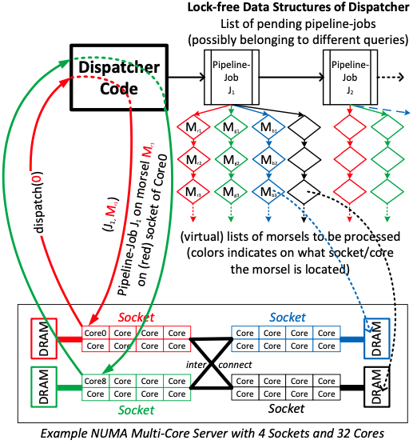
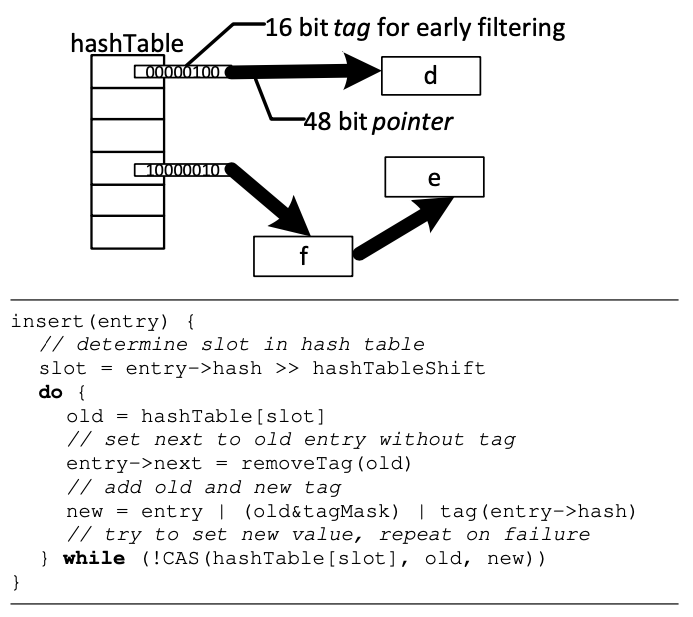
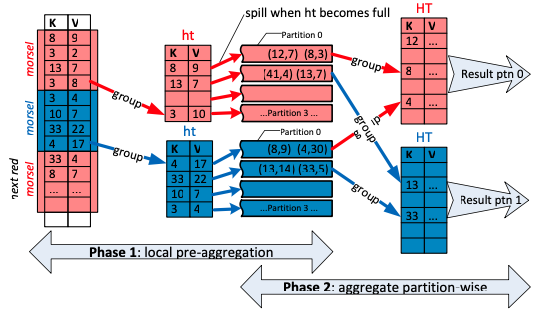
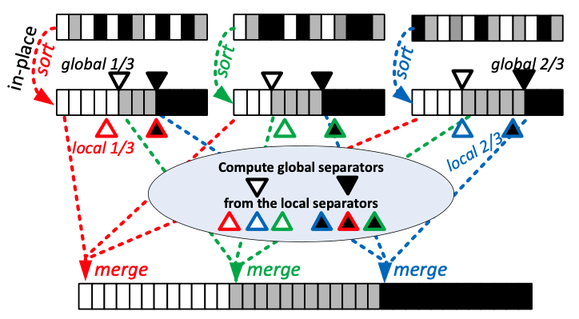
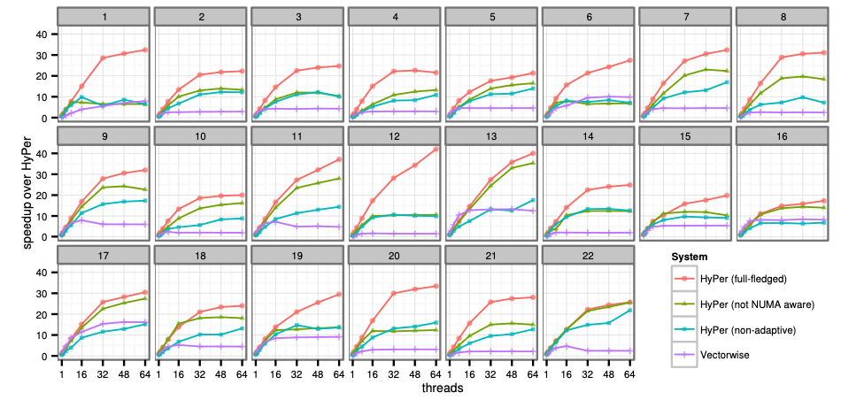
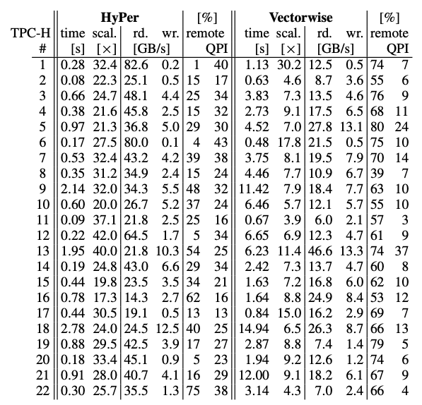

# 慕斯驱动并行

> citypop 拯救我

今天写一下 Morsel-Driven Parallelism: A NUMA-Aware Query Evaluation Framework for the Many-Core Age 的读后感。这篇文章是 TUM 数据库组发表在 SIGMOD14 上的工作，也是他们组在内存数据库 HyPer 上进行的一系列经典工作之一。

## Background

### Multi-core and NUMA

首先就是现代 CPU 在朝着高频发展的道路上逐渐遇到瓶颈，转而向多核心的方向发展。随着 CPU 核心数越来越多，UMA（Uniform Memory Access）的形式会对总线带宽带来压力，因而出现了 NUMA（Non-Uniform Memory Access）。

每个 NUMA 节点（或者 socket）有自己的 local memory 以及多个 cores。每个 core 有自己的 LLC（Last Level Cache）。[这篇博客](https://blog.csdn.net/He11o_Liu/article/details/79694325)给了在 Sandy Bridge 架构下的访存开销：

1. 访问 L1 需要 4 cycles。
2. 访问 L2 需要 12 cycles。
3. 访问 L3（LLC）需要 26 - 31 cycles。
4. 访问 local memory 需要 190 cycles。
5. 访问 remote memory 需要 310 cycles。

然后下图给了带宽的数据：

看到 local memory 和 remote memory 延迟和带宽的差距，一个很容易想到的程序优化技巧就是利用 NUMA locality。

### Main-memory Database

然后另一个趋势是内存越来越大，能达到 TB 级别，因此涌现出了很多内存数据库，比如 HyPer 和 SAP HAHA 等等。在这些内存数据库中，查询摆脱了磁盘 IO 的瓶颈，因此我们转而专注于如何充分利用 multi-core 的性能。一般大多数数据库使用 Volcano 执行模型（Pull 模式），每个算子都实现了 Next 函数，这个函数里是先递归调用孩子的 Next 算子，然后做自己的计算逻辑吐出数据。然后 Volcano 模型想要利用 multi-core 的话，最简单的方式是一个算子的 Next 函数改造成多线程的，比如多线程 sort，多线程 build hash table 等等。然后高级一点就是利用 Exchange 算子对数据进行 shuffle/partition，实现 data parallelism。

Note：
1. 以前一直以为多机器节点的分布式执行才有 Exchange 算子，拿衣服了。

首先我们把这种执行模式批判了一番：

1. 这种并行方案是 plan-level 的，优化器需要在查询优化阶段就根据统计信息决定怎么切分数据，用多少并发去执行。在算子启动的时候 n 个 worker thread 已经 launch 出去了，很难在执行阶段再动态地调整。有些 worker thread 已经完成工作了，还有些还没完成（data skew 或者 worker thread 分到的时间片太少了或者某个 core 不太行），总耗时取决于最慢的那个 worker thread。而且可能出现一核有难七核围观的场景。Kill query 也不太好做，worker thread 已经 launch 出去的话可能得要跑完才会结束了。
2. 基于第一点，没有一个全局的线程管理或者说 CPU 资源管理，很多事情就难做。比如查询优先级，现在有一个很重的 AP 查询在跑，然后来了个用户对 latency 有要求的 TP 查询，那么理想的数据库应该让 TP 查询先放到 CPU 上去跑，TP 查询跑完再继续跑 AP 查询。但现实有可能是 AP 查询的线程多，占着 CPU 一直跑，TP 查询就一个线程轮到的时间片少的可怜。再比如多租户场景或者一些混部场景，可能会要求限制这个数据库程序只能用 60% 的 CPU，这个也很难实现。
3. 这种并行方案没有考虑 NUMA locality。

## Morsel-driven Execution

那么为了解决上面这些局限性，作者提出了 Morsel-drive 的执行模式，核心思想是将查询执行切分成粒度很小的 run-time、NUMA-aware 的任务，然后有一个全局的 dispatcher 调度线程去不断完成这些任务。Morsel 的中文含义是一小口，非常形象，把一个个查询执行想象成一个个蛋糕，然后数十上百个线程蜂拥而上，一小口一小口地把一个个蛋糕吃干净。

接下来展开讲讲。HyPer 本身是 Push 模式，执行计划可以划分成若干个 pipeline，不同 pipeline 之间存在依赖关系，构成一个 DAG。然后上面说的粒度很小的任务是指某 pipeline 里某个算子配上一小块输入（比如大约 10000 条数据），然后一个线程领到任务后要做的事情就是对这一小块输入 apply 这个算子得到一小块输出。总的线程数等于 core （准确来说是 virtual core）的数量，每个线程都是绑在一个固定的 core 上。dispatcher 会尽可能分配 local 的任务给每个线程，也就是说这个任务的输入输出的内存地址对于这个绑核的线程来说都是 NUMA-local 的。然后我们就能得到以下的好处：

1. 首先线程数量固定。不会因为并发查询数量增多而不断创建新的线程。因此，不会有太大的 context switch 的开销。
2. 然后每个线程都是绑核的，不会被 OS 调度到另一个 core 上去，然后 dispatcher 会尽可能把 NUMA-local 的 task 发给每个线程，减少了 cross-socket memory traffic，绝大部分操作在 local memory 上完成，就很快。
3. Task 的粒度很小，且是执行时动态分发的，就能做到 fully elastic。每个 task 的 input 都是相同大小，首先避免了 data skew。绑核的线程虽然可能执行 task 有快有慢，但执行快的可以去领新的 task。Task 粒度足够小保证了最慢的线程也不会费特别长的时间。 Dispatcher 是 global-level 而不是 plan-level 的，那么可以轻易地做到在查询执行时动态地调节查询执行的并发度。Dispatcher 还很容易集成各种优先级调度策略，避免上面说的 AP 查询饿死 TP 查询的情况。Task 粒度很小还能保证 kill query 能迅速生效。CPU 资源控制之类的操作也非常好实现。

接下来近距离看一个例子感受一下。比如 HashJoin(HashJoin(Filter(R), Filter(S)), Filter(T))，有三个 pipeline，分别是：

1. DataSource(S)->Filter->HashBuild1
2. DataSource(T)->Filter->HashBuild2
3. DataSource(R)->Filter->HashProbe1->HashProbe2

其中 pipeline 3 需要前两个 pipeline 完成以后才能执行。

每一个查询都有一个 QEPobject，会维护 pipeline 之间的依赖关系。当某个 pipeline 的依赖都执行完以后，QEPobject 会把这个 pipeline 交给 dispatcher，让后者把这个 pipeline 的 tasks 分发给不同线程。QEPobject 还负责申请用来写中间结果的临时内存。当中间结果全部完成时，会把中间结果等分成若干 morsel，作为后继任务的划分依据，这种 re-fragment 可以避免 data skew，使得每个 task 的工作量都几乎相等。原话是 after completion of the entire pipeline the temporary storage areas are logically re-fragmented into equally sized morsels; this way the succeeding pipelines start with new homogeneously sized morsels instead of retaining morsel boundaries across pipelines which could easily result in skewed morsel sizes。

Note：
1. 比如第一个和第二个 pipeline 的输出结果是一个 hash table，其实 hash table 是没法 re-fragment 的，因为 probe 端有可能访问到 hash table 里任何一条数据。不过后面会提到在一些特殊情况下 hash table 也能做到 NUMA locality 的。
2. 比如 DataSource(S)->Filter->HashBuild1 这个 pipleline，DataSource(S) 被划分成相同大小的 morsel，但经过 Filter 以后输出结果大小不同（0 到 10000 的 data skew 感觉也还好，不是啥大问题），这时候需要 re-fragment 吗。我猜是不用，因为 re-fragment 本身会有 cross-socket memory traffic，开销也不小，没必要。
3. 全文似乎没有提到一个具体的 re-fragment 的例子。

接下来先具体讲了 DataSource(T)->Filter->HashBuild2 这个 pipeline 的执行可以分为两阶段，第一阶段做 filter，第二阶段做 build hash table。比如红色的 local memory 和红色的线程绑的核是在同一个 NUMA 节点里，非常直观，可以看到 filter 的 morsel input 和 morsel output 都在执行线程所在的 socket 的 local memory 里。 

Note：
1. 这里我其实有一个很蠢的问题。列存数据库是完全每列分开存的话，似乎不能这样直接切成 morsel，至少得行列转化一下才行，否则一片不大且连续的内存里可能不包含某行的所有列。
2. 原文说 in the first phase the filtered tuples are inserted into NUMA-local storage areas, i.e., for each core there is a separate storage area in order to avoid synchronization。其实我不太清楚这里的 synchronization 是指保证 cache coherence 的同步开销（比如 mesi 协议）还是更上层的同步（比如锁）。

然后第二阶段就是 build hash table。首先经过第一阶段的 filter 以后，我们能确定 hash table 有多大了（文中叫 perfect sizing）。我能想到的好处就是 hash table 构建的时候不会发生 rehash 扩容了，这可能给 hash table 并发插入的设计省了很多心（作者采用了一个无锁实现）。 然后 value 不是真的写进 hash table，而是写一个指针，指向 filter 之后输出的中间结果。然后作者讲到 this global hash table will be probed by threads located on various sockets of a NUMA system; thus, to avoid contention, it should not reside in a particular NUMA-area and is therefore is interleaved (spread) across all sockets。

Note：
1. 首先，如果 hash table 完全在一个 NUMA 节点的 local memory 里肯定是不好的，会有 contention。这里同样我不太清楚 contention 是 cache coherence 层面的吗。
2. Hash table 是多个线程并发构建的。比如某个线程最先写 hash table 的某个 page，那么这个 page 就会开在这个线程在的 socket 的 local memory 里。这样就能保证 hash table 是 interleaved across all sockets。

然后是 DataSource(R)->Filter->HashProbe1->HashProbe2 这个 pipeline 的执行，也非常直观。

## Dispatcher

Dispatcher 是 morsel-driven 执行框架的核心，它负责将计算资源（CPU）充分合理地分配给各个查询的 pipeline。实际有多少个 hardware thread，HyPer 就预先创建好这么多个 worker thread，然后绑定住。Dispatcher 以 task 为基本单元给各个 worker thread 分配工作。一个 task 是指一个 pipeline job（大致对应 pipeline 里的一个 operator？）加上一个 morsel input。这种执行方式一定程度上绕开了 OS 的抢占式线程调度，换用更科学的方式利用计算资源：

1. Worker thread 执行的 task 的 morsel input 是在 local memory 上，充分利用了 NUMA locality。
2. 细粒度的 task 保证了 elasticity。
3. 细粒度且大小相同的 task 保证了 load balance 和 skew resistance。

Note：
1. 其他一些没有那么计算密集的任务（查询优化、一些后台任务之类的）可能是另开线程执行的，偶尔分到点 CPU 时间片跑跑？

从图中可以看到，dispatcher 维护了一个 pipeline job 的链表，表示目前可以执行的 pipeline job，然后每个 pipeline job 下面挂着不同 NUMA 节点上需要被处理的 morsels。注意同一个 query 里的 pipeline 之间存在依赖关系，在 QEPobject 中维护。一个 pipeline 只有它的依赖全部已经执行完了，它的 pipeline jobs 才能放进这个链表里。

Dispatcher 调度 worker thread 去完成各种 task，这里的调度策略可以实现成各种各样的。比如最常见就是优先级调度，不同优先级分别维护自己的 pipeline job 链表，只有高优先链表空了才考虑低优先级链表。这样，一个长时间跑的 AP 查询的优先级一般比较低，它跑着跑着，一个用户希望马上得到反馈的 TP 查询进来了，优先级比较高，然后 worker thread 都优先去做 TP 查询的 task 了，很快 TP 查询就能跑完，接下来 worker thread 就继续集中于 AP 查询的 task。

Dispatcher 看起来像由一个单独的线程负责，但如果这样的话，它需要一个 core 来跑，会跟 worker thread 抢时间片，尤其考虑到 morsel size 小的时候 dispatcher 的逻辑会被频繁调用。所以 dispatcher 实现成一个全局内存结构，所有调度逻辑都是通过 worker thread 被动触发执行，并通过无锁数据结构（比如 pipeline job queue 和 associated morsel queues）来保证高并发调用下调度逻辑不会成为瓶颈。被动触发的逻辑还包括：发现一个 pipeline job 没有新的 morsel input 了，要把它从链表里删掉；当发现一个 pipeline 完全完成以后，要在 QEPobject 的 DAG 里删掉它，然后把没有依赖的 pipeline 对应的 jobs 再添加到 dispatcher 的链表里。

Dispatcher 还实现了 work stealing。比如一个 work thread 发现自己 NUMA 节点上的 morsel 已经没了，那么它去偷另一个 NUMA 节点上的 morsel 来执行。

Note：
1. 全局 dispatcher 的好处这么多，坏处可能就是难写，比如要无锁避免成为瓶颈，要实现成被动调用，要实现 work stealing 等等。
2. 文中表示 work-stealing from remote sockets happens very infrequently; nevertheless it is necessary to avoid idle threads。把数据切成 morsel 均匀分配在各个 NUMA 节点上的话，确实 work stealing 不太会发生。考虑 DataSource(T)->Filter->HashBuild2，如果 DataSource(T) 的 morsel 分布是均匀的，Filter 是一个 input morsel 映射到一个 output morsel，所以 Filter 输出的 morsel 分布也是均匀的，只是每个 morsel 里的数据量可能不一样。题外话，如果经过 Filter 以后每个 morsel 都只有一行数据，是不是会造成一些性能问题，不知道有没有同一个 NUMA 节点上进行 morsel merge 的操作（output morsel 应该不会相较于 input morsel 膨胀，那 morsel split 估计不用）。
3. 文中讲到 the writing into temporary storage will be done into NUMA local storage areas anyway。这里我其实不太了解读 remote memory 的机制，是读 remote memory 就等于拷贝到 local memory 一份吗。之后仔细研究一下。
4. Work stealing 没做消融实验。

然后作者讨论了 intra-pipeline parallelism。比如 DataSource(S)->Filter->HashBuild1 和 DataSource(T)->Filter->HashBuild2 相互没有依赖，可以并行执行（文中叫 bushy parallelism）。但作者禁止了同一个 query 里的多个 pipeline 并行执行，理由有两条：

1. The number of indepen- dent pipelines is usually much smaller than the number of cores, and the amount of work in each pipeline generally differs.
2. Bushy parallelism can decrease performance by reducing cache locality.

第二条理由我能理解，但第一条我没懂是啥意思。

Note：
1. 即使在单机内存数据库里 bushy parallelism 用处有限且在 cache locality 等方面有负面作用，但我觉得 bushy parallelism 可能在其他场景下还是有价值的，比如更大规模的数据量、多节点分布式计算（对 cache locality 没那么敏感）、计算资源充足、想尽可能充分并行的场景？ 我联想到另外一个有趣的事实，很多数据库在 join reorder 的时候只考虑 left-deep tree，不考虑 bushy tree。我印象里的原因是 bushy tree 左右孩子并行执行的内存开销会很大，单节点可能撑不住，还有一个原因就是搜索空间会变大。但多节点分布式计算的情况下通过 exchange data 可以避免单节点巨大的内存开销，这种情况下 bushy tree 应该有用武之地，简单查了一下发现 MaxCompute 是做了 bushy tree 的。有点好奇有没有论文专门讨论 bushy parallelism / bushy tree 在各个场景下的优劣以及什么场景适合。
2. 仔细看了 HashJoin(HashJoin(Filter(R), Filter(S)), Filter(T)) 三条 pipeline 的切分，感觉似乎这种切分方式不是并行最大化的。DataSource(S)->Filter->HashBuild1 构建完第一个 probe 就可以开始做了，不需要两个 hash table 都构建完才开始第一个 probe。可能因为三条 pipeline 的切分比较简单，或者有其他方面优势，所以放弃了更充分利用并行的方式（从 HyPer 拒绝 bushy parallelism 看并行最大化并不是唯一的优化目标，有时候节约内存或者简化实现更重要）。一般来说，hash join 需要 hash table 构建完成才能开始执行 probe 端，无论是 Volcano 模型（Pull）还是 Pipeline 模型（Push）都是如此。但这里其实有个细节，有些算子从开始执行到吐出第一行可能会花费很长时间（比如一些要物化中间结果的算子，sort，topk，hash join 等），在一些优化器的代价模型里甚至有个变量描述从开始执行到吐出第一行的时间。并不是说 hash table 构建完成才能开始执行 probe 端的算子，而是 hash table 构建完成才能让 probe 端算子吐出第一行数据。所以在 hash table 构建的时候，probe 端如果是要物化中间结果的算子，也可以并行地执行起来，然后到 hash table 构建好的时候就可以立马吐出第一行数据。不太确定有没有什么数据库的实现里 build hash table 的同时会并发开始执行 probe 端。这种 bushy parallelism 能更充分地并行，但也可能带来负面作用（比如更大的内存开销）。

作者还提了一下 kill query 的实现。一旦一个 query 被标记上 kill，它的所有未完成的 task 都不会再进行。在 task 粒度上实现的 kill query 能高效地终止查询。相比之下，Volcano 模型每次调用 next 前后检查是否 kill 可能还不够，比如 hash join 调用第一次 next 的耗时可能非常久（在构建 hash table），出现 kill 执行了以后 query 迟迟没终止的情况。这种情况需要在算子实现内部添一些 kill 检查。

然后作者讨论了一下 morsel size。Morsel size 如果太小的话，会造成 task 过多且一个 task 很快就跑完，进而频繁调用 dispatcher 的逻辑成为瓶颈。Morsel size 太大的话，elasticity 和 load balance 都会打折扣。作者简单做了个实验，发现 morsel size 在 10000 的时候 dispatcher overhead 就基本可以忽略了，所以默认把 morsel size 就设置成 10000。

Note：
1. 作者提到 in contrast to systems like Vectorwise and IBM’s BLU, which use vectors/strides to pass data between operators, there is no performance penalty if a morsel does not fit into cache。向量化的时候 chunk 太大塞不进 cache 的 performance penalty 分析后面得去再读一下原文。

然后作者提到即使 dispatcher 用了无锁结构，还是容易成为限制 scalability 的瓶颈。作者表示考虑到以下几点，这个问题在现实中其实还好：
1. In our implementation the total work is initially split between all threads, such that each thread temporarily owns a local range. Because we cache line align each range, conflicts at the cache line level are unlikely. Only when this local range is exhausted, a thread tries to steal work from another range. 我理解主要是两点，第一点是 dispatcher 的数据结构似乎被切成了若干个 range，每个 thread 优先去访问 local range。但这里说得太模糊了，不太清楚 split range 具体是怎么样的。第二点是 cache line align，应该是避免出现 false sharing。
2. If more than one query is executed concurrently, the pressure on the data structure is further reduced. 我理解是 query 多了并发访问 dispatcher 时的冲突也会减少，但没写具体实现也很难深入讨论。
3. It is always possible to increase the morsel size. 实在没办法就调大 morsel size 呗。

## Parallel Operator Details

然后讲讲各个算子怎么切成小的 task 实现 data parallelism。

### Hash Join

在 build hash table 阶段，第一步是每个 worker thread 先把 input tuples 写到自己的 local memory 里。第一步完成后，hash table 的 perfect size 知道了，第二步是把指向 tuple 的指针插入到一个大小固定不需要扩容的 hash table 中。如果是 outer join 且 build 端是 outer 端，那么 tuples 里会多一个 marker。在 probe 的时候如果匹配会把 marker 设置一下。Probe 完成以后会再扫一遍 hash table 把 marker 没设置的 tuples 读出来。

如上图所示，hash table 是一个无锁实现。作者做了一个 early-filtering 的优化，在 probe 的时候，如果 16bit tag 告诉我们这个元素不存在，那就不用费劲去链表里再匹配了，类似 Bloom filter。为了省空间，链表头部的 64bit int 拆成了 16 bit tag 加上 48bit pointer，更新的时候可以利用 CAS 把 tag 和 pointer 进行原子化更新。作者表示利用 CAS 进行无锁 insert 的算法是建立在我们知道 hash join 中对 hash table 是先 insert 完再 lookup 的前提下，但我其实没想明白没有这个前提的话 insert 和 lookup 会有问题吗。这个 early-filtering 的技巧在大部分 key 是 unique 的情况下进行 aggregation 的时候也可以利用上。

作者还对 hash table 进行了一些 OS 层面的优化。比如用 2MB 的大页，这样可以减少 TLB miss，页表可以放进 L1 cache，减少 page fault。作者给 hash table 申请内存是用 mmap，这里我不太理解，hash table 是暂存在内存里的，不用落盘，为啥要用 mmap。大多数操作系统分配内存是 lazy 的，当一个 page 被某个 worker thread 写的时候才会真正在对应的 local memory 里申请内存。因此如果很多 worker thread 在 hash table 上进行 insert，那么 hash table 是 pseudo-randomly interleaved over all nodes。如果只有一个 worker thread 在 hash table 上进行 insert，那么 hash table 就完全在对应的 local memory 里。

### Table Partitioning

为了实现 NUMA-local table scan 的时候，我们需要把 tuples 均匀地分配在各个 NUMA 节点的内存中。最简单的方式就是 round-robin。但其实有时候按某个重要的列（比如主键、外键）的 hash value 进行内存层面的 partition 会更好。举个例子，TPCH 里的 orders 和 lineitem 都有 orderkey，两张表都按 orderkey 的 hash value 在内存层面进行 partition，然后有查询是 orders 和 lineitem 以 orderkey 为 join key 进行 join，假设 build hash table 的时候也用同一个 hash function，那么很可能 build 端的 tuples、hash table 里的对应部分、probe 端的 tuples 都在同一个 local memory 里，cross-socket communication 大大减少，性能提高。

Note：
1. 其实这种观察 workload 然后精心设计 partition 方案的操作在很多分布式数据库里也常见，为了尽可能实现 local join 或者 local txn，降低网络开销。

### Aggregation

HyPer 的 Aggregation 算法是一个典型的 2-phase agg。第一阶段是 thread-local agg，这里作者用了一个巧妙的做法，能同时应对 local ndv 很大和 local ndv 很小的情况。比如在 local ndv 很小的时候做 local agg 效果好，但 local ndv 很大的时候 local ndv 不如不做。这里的 thread-local agg 是开了一个 thread-local, fixed-sized hash table，如果 hash table 满了且 key 不在 hash table 里，那么对这个 key 直接放弃 agg 操作。如果 local ndv 很小，那么 fixed-sized hash table 大概率能装下所有 key，几乎等价于做了 local agg；如果 local ndv 很大，那么对大部分 tuples 而言其实都没做 local agg。感觉这种方式要比让优化器决定是否做 local agg 更优雅。同事告诉我很多 AP 数据库都用了这个技巧，在 StarRocks 里这个技巧叫 AggregateStreaming（[StarRocks 聚合算子源码解析](https://zhuanlan.zhihu.com/p/592058276)）。另外第一阶段还会对数据做 hash partition，然后第二阶段每个 worker thread 的任务就是完成单个 partition 上的 agg。可以看到这个 NUMA-aware 2-phase agg 和 MPP 数据库里的 2-phase agg 非常类似。只不过前者是要充分利用 multi-cores 并减少 cross-socket communication，而后者是要充分利用 multi-nodes 并减少 network communication。

### Sort

HyPer 的 Sort 算法也是一个两阶段的 merge sort。第一阶段就是 local sort。然后在 local sort 的结果中定出 local separator。然后根据 local separator 计算出 global separator。然后根据 global separator 给 worker thread 划分出各自 merge 哪一段 range。这里的难点是如何通过 local separator 计算出 global separator，确保依据 global separator 划分出的各段 range 没有太大的 data skew。作者采用了类似 median-of-medians 的算法，具体没有细说。比如最简单的只有一个 separator 的情况（global separator 把 range 一分为二），我猜是根据 median-of-medians 算法算了一个近似中位数，近似误差控制在一个范围里。

Note：
1. 感觉 median-of-medians 算法挺有趣的，我看了这篇[BFPRT——Top k问题的终极解法](https://zhuanlan.zhihu.com/p/291206708)。

## Evaluation

作者在 TPC-H 上对比了 HyPer 和 Vectorwise 的性能，机器是32核64线程的 Nehalem EX，结果如下：

随着使用的 core 的个数的增加，HyPer 展现出比 Vectorwise 更强的 scalability。消融实验也证明了 NUMA-aware 对性能很重要。

这个表里其他数据都符合预期，但 QPI 的数据有点奇怪。文中提到 The "QPI" column shows the utilization of the most-utilized QPI link (though with NUMA-awareness the utilization of the links is very similar)。HyPer 是 NUMA-aware 的，大多数是 local memory access，而 VectorWise 并不是 NUMA-aware 的，然后 VectorWise 的 QPI 要比 HyPer 低。作者注释写了 The QPI links are used both for sending the actual data, as well as for broadcasting cache coherency requests, which is unavoidable and happens even for local accesses. Query 1, for example, reads 82.6GB/s, 99% of it locally, but still uses 40% of the QPI link bandwidth. 但感觉还是有些奇怪。

##  Some Thoughts

1. Morsel-Driven Parallelism 的影响深远，如今在很多 OLAP 数据库上（比如 ClickHouse、DuckDB 等）都能看到它的影子。
