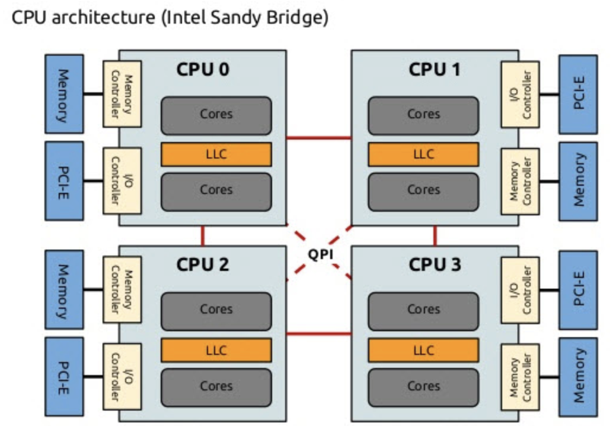
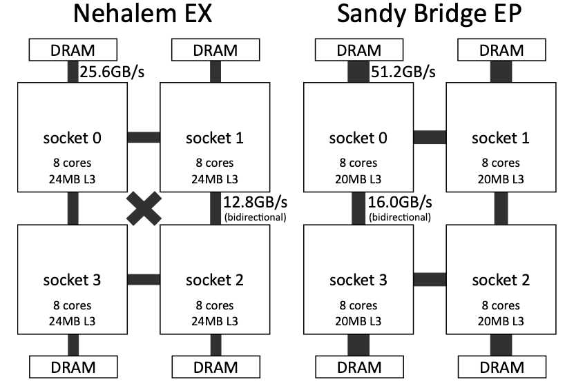
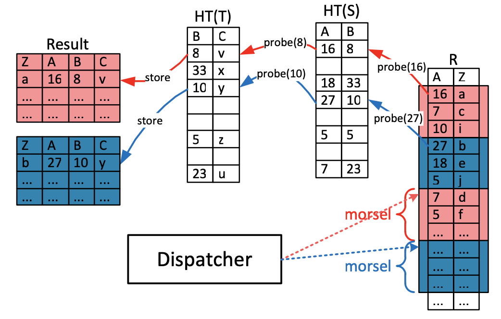
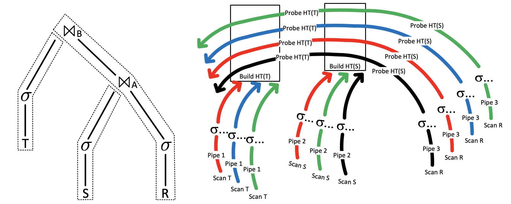
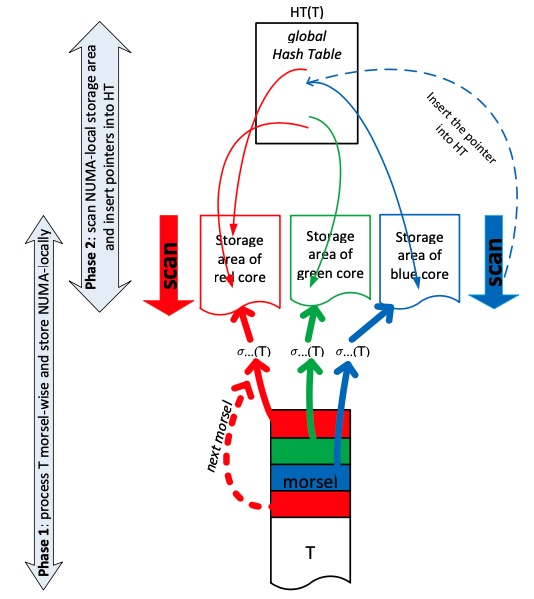

# 慕斯驱动并行

> citypop 拯救我

今天写一下 Morsel-Driven Parallelism: A NUMA-Aware Query Evaluation Framework for the Many-Core Age 的读后感。这篇文章是 TUM 数据库组发表在 SIGMOD14 上的工作，也是他们组在内存数据库 HyPer 上进行的一系列经典工作之一。

## Background

### Multi-core and NUMA

首先就是现代 CPU 在朝着高频发展的道路上逐渐遇到瓶颈，转而向多核心的方向发展。随着 CPU 核心数越来越多，UMA（Uniform Memory Access）的形式会对总线带宽带来压力，因而出现了 NUMA（Non-Uniform Memory Access）。

每个 NUMA 节点（或者 socket）有自己的 local memory 以及多个 cores。每个 core 有自己的 LLC（Last Level Cache）。[这篇博客](https://blog.csdn.net/He11o_Liu/article/details/79694325)给了在 Sandy Bridge 架构下的访存开销：

1. 访问 L1 需要 4 cycles。
2. 访问 L2 需要 12 cycles。
3. 访问 L3（LLC）需要 26 - 31 cycles。
4. 访问 local memory 需要 190 cycles。
5. 访问 remote memory 需要 310 cycles。

然后下图给了带宽的数据：

看到 local memory 和 remote memory 延迟和带宽的差距，一个很容易想到的程序优化技巧就是利用 NUMA locality。

### Main-memory Database

然后另一个趋势是内存越来越大，能达到 TB 级别，因此涌现出了很多内存数据库，比如 HyPer 和 SAP HAHA 等等。在这些内存数据库中，查询摆脱了磁盘 IO 的瓶颈，因此我们转而专注于如何充分利用 multi-core 的性能。一般大多数数据库使用 Volcano 执行模型（Pull 模式），每个算子都实现了 Next 函数，这个函数里是先递归调用孩子的 Next 算子，然后做自己的计算逻辑吐出数据。然后 Volcano 模型想要利用 multi-core 的话，最简单的方式是一个算子的 Next 函数改造成多线程的，比如多线程 sort，多线程 build hash table 等等。然后高级一点就是利用 Exchange 算子对数据进行 shuffle/partition，实现 data parallelism。

Note：
1. 以前一直以为多机器节点的分布式执行才有 Exchange 算子，拿衣服了。

首先我们把这种执行模式批判了一番：

1. 这种并行方案是 plan-level 的，优化器需要在查询优化阶段就根据统计信息决定怎么切分数据，用多少并发去执行。在算子启动的时候 n 个 worker thread 已经 launch 出去了，很难在执行阶段再动态地调整。有些 worker thread 已经完成工作了，还有些还没完成（data skew 或者 worker thread 分到的时间片太少了或者某个 core 不太行），总耗时取决于最慢的那个 worker thread。而且可能出现一核有难七核围观的场景。Kill query 也不太好做，worker thread 已经 launch 出去的话可能得要跑完才会结束了。
2. 基于第一点，没有一个全局的线程管理或者说 CPU 资源管理，很多事情就难做。比如查询优先级，现在有一个很重的 AP 查询在跑，然后来了个用户对 latency 有要求的 TP 查询，那么理想的数据库应该让 TP 查询先放到 CPU 上去跑，TP 查询跑完再继续跑 AP 查询。但现实有可能是 AP 查询的线程多，占着 CPU 一直跑，TP 查询就一个线程轮到的时间片少的可怜。再比如多租户场景或者一些混部场景，可能会要求限制这个数据库程序只能用 60% 的 CPU，这个也很难实现。
3. 这种并行方案没有考虑 NUMA locality。

## Morsel-driven Execution

那么为了解决上面这些局限性，作者提出了 Morsel-drive 的执行模式，核心思想是将查询执行切分成粒度很小的 run-time、NUMA-aware 的任务，然后有一个全局的 dispatcher 调度线程去不断完成这些任务。Morsel 的中文含义是一小口，非常形象，把一个个查询执行想象成一个个蛋糕，然后数十上百个线程蜂拥而上，一小口一小口地把一个个蛋糕吃干净。

接下来展开讲讲。HyPer 本身是 Push 模式，执行计划可以划分成若干个 pipeline，不同 pipeline 之间存在依赖关系，构成一个 DAG。然后上面说的粒度很小的任务是指某 pipeline 里某个算子配上一小块输入（比如大约 10000 条数据），然后一个线程领到任务后要做的事情就是对这一小块输入 apply 这个算子得到一小块输出。总的线程数等于 core （准确来说是 virtual core）的数量，每个线程都是绑在一个固定的 core 上。dispatcher 会尽可能分配 local 的任务给每个线程，也就是说这个任务的输入输出的内存地址对于这个绑核的线程来说都是 NUMA-local 的。然后我们就能得到以下的好处：

1. 首先线程数量固定。不会因为并发查询数量增多而不断创建新的线程。因此，不会有太大的 context switch 的开销。
2. 然后每个线程都是绑核的，不会被 OS 调度到另一个 core 上去，然后 dispatcher 会尽可能把 NUMA-local 的 task 发给每个线程，减少了 cross-socket memory traffic，绝大部分操作在 local memory 上完成，就很快。
3. Task 的粒度很小，且是执行时动态分发的，就能做到 fully elastic。每个 task 的 input 都是相同大小，首先避免了 data skew。绑核的线程虽然可能执行 task 有快有慢，但执行快的可以去领新的 task。Task 粒度足够小保证了最慢的线程也不会费特别长的时间。 Dispatcher 是 global-level 而不是 plan-level 的，那么可以轻易地做到在查询执行时动态地调节查询执行的并发度。Dispatcher 还很容易集成各种优先级调度策略，避免上面说的 AP 查询饿死 TP 查询的情况。Task 粒度很小还能保证 kill query 能迅速生效。CPU 资源控制之类的操作也非常好实现。

接下来近距离看一个例子感受一下。比如 HashJoin(HashJoin(Filter(R), Filter(S)), Filter(T))，有三个 pipeline，分别是：

1. DataSource(S)->Filter->HashBuild1
2. DataSource(T)->Filter->HashBuild2
3. DataSource(R)->Filter->HashProbe1->HashProbe2

其中 pipeline 3 需要前两个 pipeline 完成以后才能执行。

每一个查询都有一个 QEPobject，会维护 pipeline 之间的依赖关系。当某个 pipeline 的依赖都执行完以后，QEPobject 会把这个 pipeline 交给 dispatcher，让后者把这个 pipeline 的 tasks 分发给不同线程。QEPobject 还负责申请用来写中间结果的临时内存。当中间结果全部完成时，会把中间结果等分成若干 morsel，作为后继任务的划分依据，这种 re-fragment 可以避免 data skew，使得每个 task 的工作量都几乎相等。原话是 after completion of the entire pipeline the temporary storage areas are logically re-fragmented into equally sized morsels; this way the succeeding pipelines start with new homoge- neously sized morsels instead of retaining morsel boundaries across pipelines which could easily result in skewed morsel sizes。

Note：
1. 比如第一个和第二个 pipeline 的输出结果是一个 hash table，其实 hash table 是没法 re-fragment 的，因为 probe 端有可能访问到 hash table 里任何一条数据。不过后面会提到在一些特殊情况下 hash table 也能做到 NUMA locality 的。
2. 比如 DataSource(S)->Filter->HashBuild1 这个 pipleline，DataSource(S) 被划分成相同大小的 morsel，但经过 Filter 以后输出结果大小不同（0 到 10000 的 data skew 感觉也还好，不是啥大问题），这时候需要 re-fragment 吗。我猜是不用，因为 re-fragment 本身会有 cross-socket memory traffic，开销也不小，没必要。
3. 全文似乎没有提到一个具体的 re-fragment 的例子。

接下来先具体讲了 DataSource(T)->Filter->HashBuild2 这个 pipeline 的执行可以分为两阶段，第一阶段做 filter，第二阶段做 build hash table。比如红色的 local memory 和红色的线程绑的核是在同一个 NUMA 节点里，非常直观，可以看到 filter 的 morsel input 和 morsel output 都在执行线程所在的 socket 的 local memory 里。 

Note：
1. 这里我其实有一个很蠢的问题。列存数据库是完全每列分开存的话，似乎不能这样直接切成 morsel，至少得行列转化一下才行，否则一片不大且连续的内存里可能不包含某行的所有列。
2. 原文说 in the first phase the filtered tuples are inserted into NUMA-local storage areas, i.e., for each core there is a separate storage area in order to avoid synchronization。其实我不太清楚这里的 synchronization 是指保证 cache coherence 的同步开销（比如 mesi 协议）还是更上层的同步（比如锁）。

然后第二阶段就是 build hash table。首先经过第一阶段的 filter 以后，我们能确定 hash table 有多大了（文中叫 perfect sizing）。我能想到的好处就是 hash table 构建的时候不会发生 rehash 扩容了，这可能给 hash table 并发插入的设计省了很多心（作者采用了一个无锁实现）。 然后 value 不是真的写进 hash table，而是写一个指针，指向 filter 之后输出的中间结果。然后作者讲到 this global hash table will be probed by threads located on various sockets of a NUMA system; thus, to avoid contention, it should not reside in a particular NUMA-area and is therefore is interleaved (spread) across all sockets。

Note：
1. 首先，如果 hash table 完全在一个 NUMA 节点的 local memory 里肯定是不好的，会有 contention。这里同样我不太清楚 contention 是 cache coherence 层面的吗。
2. Hash table 是多个线程并发构建的。比如某个线程最先写 hash table 的某个 page，那么这个 page 就会开在这个线程在的 socket 的 local memory 里。这样就能保证 hash table 是 interleaved across all sockets。

然后是 DataSource(R)->Filter->HashProbe1->HashProbe2 这个 pipeline 的执行，也非常直观。

volcano 模型：并发隐藏在算子里，shared state is avoided,

pipeline 概念感觉很模糊，jit 是 operator level 吗

vector-at-a-time 就是向量化吧

jit + vector hyper 都有。。。

refregment to avoid skew 所有情况下都适用吗，hash build 就不适用吧

In order to write NUMA-locally and to avoid synchronization 
写 local 可以避免同步？？ again numa mem arch 是怎么样的

To preserve NUMA-locality in further processing stages, the storage area of a particular core is locally allocated on the same socket.

same socket

numa 的内存沟通是走 socket 吗

fig3 似乎没有

global hash table 会被不同 socket 上的 thread 访问

如果放在一个 numa local area 里会有很多竞争吗，交通不均衡？？

具体怎么放呢，lb？？

pipeline 依赖关系 dag，（内存消耗会比 pull 模型多吗，三表 hash join 那里好像没有，都得物化

Preemption of a task occurs at morsel boundaries – thereby elimi- nating potentially costly interrupt mechanisms.

没有 oi 操作，没有阻塞。

pull vs push pull 天然带流控

The dispatcher’s code is then executed by the work- requesting query evaluation thread itself

应该还有一些去 dispatcher 里放任务的工作吧，比如一个 pipeline 的依赖都完成了，要把它放进 dispatcher 里，这种是低频操作？而且 morsel 队列可以由 worker 自己更新。

pipeline 的添加也可以用 worker 完成？yep

内存数据库落盘策略啥的

bushy parallelism
两个 hash table building 不能并行

一个 morsel 大概要执行多久

kill next 粒度控制

false sharing 
mesi 协议

一个集中的数据结构管理线程
好处，自己执行调度规则
坏处，很难写，容易变成瓶颈，

Second, if more than one query is executed concurrently, the pressure on the data structure is further reduced.
减少竞争

hash join
outer side is build side
marked
probe 完再扫一遍，这个也可以 morsel-driven 吗

perfect hash size
collision

tagging is also very beneficial during aggregation when most keys are unique.
agg 的时候怎么用

mmap
hash table 是中间结果，干嘛落盘

numa aware 的技巧是不是跟多节点 shuffle 数据的技巧异曲同工

local join 好像跟它说的 hash join 不太一样，哦 mmap 写的时候大概率是 local 的

2-phase agg 好像 tidb mpp 啊

blu agg
fixed size hash + partition
对 ndv 很大或者很小都考虑了

ndv 很小，直接进 hash table
ndv 很大，建大的 hash table 得不偿失，所以直接 partition。

In main memory, hash-based algorithms are usually faster than sorting [4]. Therefore, we currently do not use sort-based join or aggregation, and only sort to implement the order by or top-k clause.

这跟 ap mpp 很像，全是 hash join，hash agg 基本不考虑 order/sort

medium of medium

列存读数据读块
有个多列合并的操作吗

data skew from volcano 能举个例子吗
partition->filter
有其他例子吗

fixed workload division, compile time, skew
depend on stats or not

adaptive morsel-wise processing 
work-stealing 吗

每个 morsel 要跑多久，一个 query 大概包含多少 morsel task

比 volcano 相比切的足够小，等最后一个的时间大大降低了。

resource control 好做

多租户

资源管控

限流