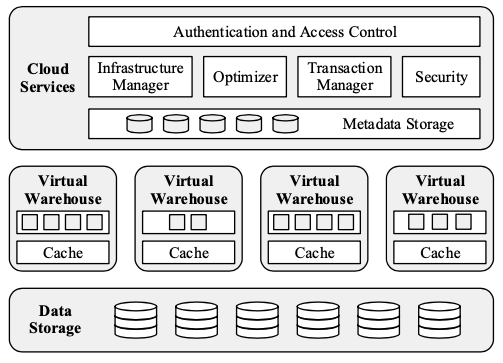
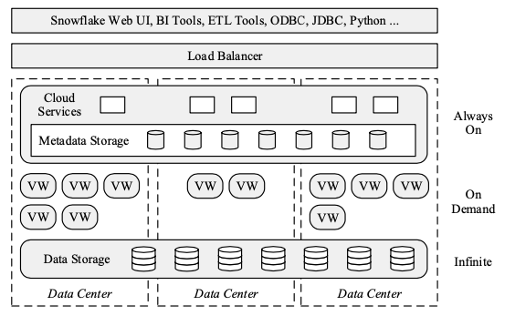
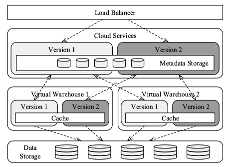

# 瓦街千堆雪

> 我不说话 等待黑暗 泪能落下

## Overview

Snowflake 是一款云原生的数仓产品，最初在2012年底开始开发，在2015年6月发布了第一个 GA（General Available）版本。Snowflake 在 SIGMOD16 上发表了论文 The Snowflake Elastic Data Warehouse，描述了一些设计和实现。数仓是一个古老而成熟的领域，诸如 TeraData、Oracle 等都有很成熟的数仓产品。然而云计算的兴起给这个行业带来了变化。作者表示，传统数仓一般会假设可用资源（机器）是固定的，而云计算的一大特点就是弹性，因此要重新设计数仓的架构来充分利用这种弹性。摘一段原文：

> The shared infrastructure of the cloud promises increased economies of scale, extreme scalability and availability, and a pay-as-you-go cost model that adapts to unpredictable usage demands. But these advantages can only be captured if the software itself is able to scale elastically over the pool of commodity resources that is the cloud.

除了充分利用弹性资源以外，研发新的数仓的动机还包括 ETL 太复杂了、knob tuning 太复杂了、数据越来越多了、大数据引擎（Hadoop/Spark）不能取代数仓。关于最后一点原文是

> They(Big Data platforms) still lack much of the efficiency and feature set of established data warehousing technology. But most importantly, they require significant engineering effort to roll out and use.

Snowflake 有如下特点：

1. Pure Software-as-a-Service (SaaS) Experience：开箱即用，简单易用，不需要买机器部署，不需要 DBA，不用调参数，不用执行数据的物理分布，不需要进行 storage grooming 的操作（数据备份、归档、删除、压缩、移动等）。
2. Relational：完整支持 ANSI SQL 和 ACID，无痛上车。作者还在 related work 里吐槽了 BigQuery 只支持狗家自己的 SQL 方言。
3. Semi-Structured：支持 JSON、Avro 等 semi-structured data，提供原生的操作 semi-structured data 的函数和 SQL 语法，进行自动的类型转换和列存优化，让操作 semi-structured data 的性能接近 plain relational data。
4. Elastic：计算和存储资源都可以独立扩展，且在扩展的时候不会影响可用性和性能。
5. Highly Available：可以容忍节点甚至整个数据中心的失败，软硬件升级的时候也不影响可用性。
6. Durable：数据存 S3 上不会丢，外加有复制、备份、闪回之类的保险措施。
7. Cost-efficient：按需分配计算资源，数据压缩节省存储资源。
8. Secure：原始数据、中间临时数据、网络数据都加密过（好奇加密解密有多大开销），防止云厂商偷看，打消用户上云顾虑，提供细粒度的权限管理机制。

## Storage vs Compute

传统的数仓一般是 shared-nothing 架构，比如 Redshift。数据会被切分，每个节点负责存一小部分数据。每个节点的计算任务也根据数据切分而确定。比如进行 join 的时候大表数据已经均匀分布在每个节点上了，只要把小表广播给各个节点，让他们执行各自任务就行。但是，计算和存储耦合在一起有如下几个问题：

1. Heterogeneous Workload：不同的 workload 对硬件和配置的要求不同，比如 bulk loading 是 io 密集型任务，复杂查询是计算密集型任务，对 io 和 cpu 的要求不一样。但在 shared-nothing 架构中每个节点都是同质的，用的硬件和配置都是一样的，只能选一个折中的方案，造成资源利用不充分。比如在做 bulk loading 的时候会 io 吃紧但 cpu 有余，而进行复杂查询的时候会 cpu 吃紧而 io 有余。
2. Membership Changes：因为每个节点要负责一部分数据，如果需要加入或者下线某个节点，需要进行数据转移，进而会影响性能。如果是某节点失败的情况，也需要数据转移，另外本身就需要多副本来保证 highly availablity 和 durablity。
3. Online Upgrade：软硬件升级要求每个节点都重启一遍。虽然可以做滚动升级，但依次重启节点都需要数据转移，性能肯定有影响。

在 on-premise 部署的情况里，一般机器是固定数量的，规划好以后很少扩缩容，机器故障率也不高，升级也很少，一年一次算很勤快了，所以对于 2、3 两点忍忍也可以接受。对于 1 也没啥办法，只能资源利用率低点。

但云上情况不一样，节点失败会更频繁，而且充分利用弹性的话肯定会有频繁的扩缩容，云上的升级迭代也很频繁。考虑到这些原因，Snowflake 采用了存算分离的架构。存储层和计算层都可以独立扩展。计算层 Snowflake 从头实现，用 EC2 去跑，存储层直接用 S3。为了降低存储层和计算层之间的网络开销，计算节点会在 local disk 上缓存数据。

Note：

1. S3 作为一种存储服务，可扩展性高，保证 99.99% data availability 和 99.999999999% durability，能容忍整个 AZ 的失败，存储成本也便宜，但 latency 很高。数据访问也有二八原则，可能只有 20% 是热数据，80% 是冷数据，那么只要把热数据捞到计算节点的 local disk 上降低数据访问的 latency（一份数据就行，不需要多副本，因为 S3 会兜底），感觉相比于所有数据都在 local disk 上且用多副本保证 availability 和 durability 的方案，可以达到性能接近的程度（cache hit rate 足够高的话）而且存储成本会明显下降。性能接近这一点文章中只提了一句 once the caches are warm, performance approaches or even exceeds that of a pure shared-nothing system，我猜理论上这是可能的，但当时应该工程上的优化还差比较多所以不太能比。存储成本这一点整篇文章都没提，按理说冷热分离的方案是能降成本的吧，还是说我理解不到位。
2. 添加、删除无状态的计算节点是很容易的，针对 2、3 两点问题，其实 Snowflake 是把问题的复杂度转移给 S3 去处理了。 
3. 针对 1 这个问题，后面会讲到 Snowflake 用不同类型的 EC2 去完成不同的 workload。

## Architecture

然后我们来具体看 Snowflake 的架构，分为三层，每层都具备 scalability 和 high availability。

1. Data Storage：用 S3 存数据和查询结果。
2. Virtual Warehouses：负责查询的执行。
3. Cloud Services：用来管理 virtual warehouses、查询和事务，存储各种元信息，包括 database schemas、access control information、encryption keys、usage statistics 等等。

### Data Storage

Snowflake 曾考虑过要不要基于 HDFS 自研存储层, 但是发现打不过 S3，决定把有限的精力投入到更有性价比的事情上，比如 Virtual Warehouses 层的 local caching 和 skew resilience。

S3 是一种对象存储服务，提供 PUT/GET/DELETE 等接口，文件不能修改或者 append，GET 可以读文件中的一部分内容。这些特点影响了 Snowflake 的 table file format 和并发控制。一张表会被水平切分成若干个不可变的 table file（对应 block/page 的概念），按 PAX 格式存储（单个 table file 里是列存）。table file header 里记录了每列的起始位置，这样可以用 GET 操作仅读取想要的那几列。

除了存表的数据以外，S3 还会存中间结果（避免计算节点 out-of-memory 或者 out-of-disk）和查询结果（客户端没必要一直跟数据库保持连接，只要等查询结果全部出了以后来 S3 上拿就行）。

诸如表结构、表在 S3 上的文件分布、统计信息、锁、事务日志（不太清楚是啥，好像当时 Snowflake 还没有 redu-undo log）等都存在 Cloud Services 层的 Metadata Storage 里。Metadata Storage 用一个 scalable transactional key-value store，印象里好像是 FoundationDB。

### Virtual Warehouses

一个 virtual warehouse（VW）由若干个 EC2 组成，这些 EC2 是执行计算任务的 worker nodes。

#### Elasticity and Isolation

VW 是纯粹的计算资源，用户可以根据需求决定开多少个 VW，没查询的时候可以关掉所有 VW。

VW 是计算资源隔离的单位。一个查询只会跑在一个 VW 里，不同的 VW 之间不存在相互干扰，天然适合多租户。当然，有些场景没那么在意隔离性，不同 VW 之间可以分享 worker node 降本增效（VW1 的工作量少，VW2 的工作量多，就可以抽调 VW1 的 worker node 去支援 VW2），Snowflake 表示这个会作为 future work 去做。

当 VW 开始执行一个查询时，一些 worker node（数量取决于查询大小）会各自启动一个 worker process 去执行这个查询，查询完成以后 worker process 会销毁，当然对于小查询来说进程启动也是不可忽视的开销，所以未来会考虑针对小查询复用 worker processes。Snowflake 目前没有部分重试的功能，出现失败就得从头再来。 

Note：

1. 好奇为啥是进程模型而不是线程模型。可能一个好处是一个进程因为 OOM 被 OS 干掉的时候不会连累其他查询的进程。多进程做 cpu/mem 等资源控制是不是比多线程难一些。
2. 感觉部分重试的功能在 Spark 这样的大数据引擎里比较常见，MPP 数据库里比较少见，可能跟数据和查询的量级有关，量级越大从头重试的代价就越高。

不同的 VM 还可以使用不同类型的 EC2 以适应不同的 workload（即解决 shared-nothing 架构的第 1 个问题），比如负责日常查询的 VM 就用 Compute Optimized EC2，某天有 bulk loading 任务就新开一个 VM 专门负责，这个 VM 里的 EC2 都是 Storage Optimized。

Note：

1. 文中没有详细讲 Snowflake 的写入流程。如果没有 redo-undo log 的话，写入必须同步到 S3 上才行。这样的话，负责 bulk loading 的 EC2 用 Storage Optimized 的类型是不是也没太大意义。

除了 VM 是弹性的之外，VM 里的 worker node 也是弹性的，这样就可以通过加 worker node 来实现性能增加但成本不变。比如，4 节点做 data load 任务需要 15 小时，32 节点做同样的任务只要 2 小时，成本是 60 : 64。如果查询能力能随着节点数量增加而线性增强的话，这个 feature 会非常有吸引力。

#### Local Caching and File Stealing

每个 worker node 会在 local disk 上对来自 S3 的表数据进行缓存。考虑到 worker node 只会读查询需要的若干列而不是所有列，缓存的基本单位是 table file header 加这个 table file 里的某列数据。然后采用的是 LRU 策略。

为了提供 cache hit rate 以及避免同一个 table file 在多个 worker node 的 local disk 上都存一份的冗余，Snowflake 会根据 table file name 来做 consistent hashing。当有 worker node 失败或者退出的时候，不需要像 shared-nothing 架构那样递交自己的数据给其他节点，这些数据逻辑归属给了其他 worker node，然后等查询实际要访问这些数据的时候其他 worker node 会从 S3 里加载到各自的 local disk 里。这种 lazy 的方式让 worker node 退出对性能影响较小（顶多 cache hit rate 受点影响），提高了 availability。

Note：
1. 文中提到采用 consistent hashing 以后，subsequent or concurrent queries accessing the same table file will therefore do this on the same worker node。Consistent hashing 规定了一个 table file 逻辑归属于哪个 worker node（即使没加载到 local disk 上），优化器根据这种分布情况来决定每个 worker node 的读数据任务。感觉还可以进一步利用这种分布情况来规划执行计划，减少网络开销，提供查询性能。

Skew handling 是对各种 AP 系统来说都很重要。总有些节点因为虚拟化或者网络等原因拖慢整体的进度。Snowflake 对 scan-level skew 做了处理。动作快的 process 在完成自己的 scan tasks 后，就会发请求给同一个查询的其他 process 尝试领新的任务。动作慢的 process 发现自己还有好多 scan tasks 没做，就会应答请求把其中一个 table file 的 scan task 递交给别人。动作快的 process 从别人那里领来新的 scan task 以后直接从 S3 拉数据，避免给动作慢的 process 造成更多负担。

#### Execution Engine

作为一个现代的 AP 系统，Snowflake 采用了 columnar、vectorized、push-based 这些常见的技术，这里不展开了，等下次仔细读完那几篇再写。

Snowflake 没有内存里的 buffer pool。AP 查询都要扫大量数据，维护 buffer pool 的意义不大（比如 mysql 的缓存策略里其实是不希望 table full scan 的大量 page 进 buffer pool 造成缓存污染的），不如省下内存给查询执行用（AP 查询可能会吃掉大量内存放中间结果，比如 hash join/agg、sort 等）。Snowflake 支持中间结果的落盘来避免 OOM。尽管内存型的 AP 数据库会更高效更快，它们无法支持更大量级的 workload。

### Cloud Services

Cloud Services 层是多租户的，有助于降成本。同时，Cloud Services 层也保证 high availability 和 scalability，我理解这里的主要难点还是 Metadata Storage 要选一个保证 high availability 和 scalability 的 OLTP 数据库（FoundationDB）。

#### Query Management and Optimization

Snowflake 的查询优化器是 cascades-style 的。统计信息在数据加载和更新的时候自动维护的。Snowflake 还把一些执行计划的细节推迟到执行阶段再做决策，比如 the type of data distribution for joins，我理解应该是比如 broadcast vs hash partition 这样的选择。这种推迟到执行阶段的决策虽然在性能上会有些损耗，但能减少执行计划出错的概率，提供更稳定可预测的性能。执行计划会下发到各个 worker node 去执行，在执行时 Cloud Services 会从各个 worker node 收集各种 execution information，帮助性能诊断和问题排查。

Note：
1. 好奇有些统计信息怎么做增量更新，比如直方图和 NDV。猜测是因为 table file level stats 比较好维护，global level stats 由 table file level stats 汇聚而成。
2. 之后想看看 adaptive execution 这部分的实现和细节。

#### Concurrency Control

并发控制也是有 Cloud Services 层处理的。Snowflake 用 MVCC 的方式实现了 Snapshot Isolation（SI） 的隔离级别。因为 S3 上的 table file 是不可变的，更新数据是用创建新的 table file 的方式，所以用 table file 为单位做 MVCC 很自然。每个 table file 的版本信息维护在 Metadata Storage 里，这样就能知道查询该读哪个版本的 table file，以及旧版本的 table file 什么时候可以 GC。

Note：
1. 当时的 Snowflake 执行小的写操作（trickle insert/update）的性能应该是比较差的，因为一个很小的写操作都要在 S3 上写一个新的 table file。文中提到了后面可能引入 redo-undo log 和 delta store 来优化。

#### Pruning

Snowflake 没有索引，用了 min-max based pruning 来减少数据扫描量。维护每个 table file 的每个列的 min 和 max，如果 [min, max] 的区间和谓词没有交集，那么这个 table file 就可以被跳过。 Snowflake 还做了 runtime filter。

## Feature Highlights

这一部分的内容读起来更像是产品宣传手册。

### Continuous Availability

首先是 fault resilience。用 S3 作为 Data Storage 服务以及用 FoundationDB 作为 Metadata Storage 服务，这两个存储产品本身提供了很强的 availability。Cloud Services 是多租户均摊成本的，因此跨 AZ 部署些无状态节点就行了。VW 里的 worker node 必须部署在同一个 AZ 里，这是网络吞吐对查询执行性能很重要，而 AZ 内的网络吞吐比跨 AZ 的高很多。一旦 VW 在的 AZ 挂了，那只能换个 AZ 新开 VW 了。

然后是 online upgrade。类似地，存储方面（Data Storage 和 Metadata Storage）交给 S3 和 FoundationDB 就行。Snowflake 的代码主要是部署在剩下的无状态节点（包括 VW 里的 worker node 和 Cloud Services 里的无状态节点）上，它们的升级很好处理。Snowflake 升级的时候会启动新版本的无状态节点，构成一个完整的新版本服务，然后渐进地把用户的连接和查询从旧版本服务切换到新版本服务，保证连接不断，查询不失败（即已经在旧版本服务上跑的查询就让它跑完，新来的查询跑在新版本服务上）。值得一提的是，新版本的 VW 和旧版本的 VW 会共享同一个 worker node，以及 worker node 的 local disk 上的数据缓存，这样升级的时候甚至不用重新从 S3 上拉数据缓存到 local disk 上。有这样丝滑、用户无感、性能不受影响的 online upgrade，Snowflake 平均每周升级一次，实现产品的快速迭代。当发现新版本有 critical bug 的时候还可以快速 online downgrade 到旧版本，修完再 online upgrade。

### Semi-Structured and Schema-Less Data

Snowflake 在 SQL 类型系统中引入了一些新类型：VARIANT、ARRAY、OBJECT，用来处理 semi-structured data。用户可以直接将 JSON、Avro、XML 格式的数据导入到 VARIANT 列中，这可以将传统的 ETL（Extract-Transform-Load）流程变成 ELT （Extract-Load-Transform），这样最后一步 Transform 就可以用 SQL 来做，充分利用 Snowflake 强大的数据处理能力，比 ETL 工具更高效。文中还提到 ETL -> ELT 的另一个优势是（我没啥数仓经验没太理解）：

>This approach, aptly called "schema later" in the literature, allows for schema evolution by decoupling information producers from information consumers and any intermediaries.

Snowflake 提供了从 ARRAY、OBJECT 中抽取元素的函数，也提供了将 ARRAY、OBJECT 展平（SQL Lateral View）以及聚合（ARRAY_AGG、OBJECT_AGG）的函数，还提供了 CAST 函数将 VARIANT 类型转成基本类型。用户可以利用这些原生的函数方便地操作 semi-structured data。

Semi-structured data 序列化以后很难用上列存优化技术，这也是倾向于将 semi-structured data 转成 plain relational data 的动机。Snowflake 用了一个不依赖 schema 的对 semi-structured data 进行列存优化的方法。在写一个 table file 的时候，会对 semi-structured data 进行统计分析，自动推导类型并找出最常见的 (typed) paths。然后这些最常见的 paths 就从 document 中被抽出来当做单独的列来存，这样就能用上列存优化了。Snowflake 还把 semi-structured data 的每一条 path 都用 Bloom filter 记录下来，如果查询指定的 path 在这个 table file 里根本没出现，那么这个 table file 可以直接跳过。

Snowflake 还做了 optimistic conversion。比如在 JSON 或者 XML 里 date/time 是存成 string 的，我们会把这种 string 转成 date/time 类型存一份。如果查询带了 cast string to date/time，那么直接用存成 date/time 的那一列就行，避免了查询时的 cast。

在做了 columnar storage、optimistic conversion、pruning over semi-structured data 这些优化以后，作者做了个实验证明在 semi-structured data 上查询性能只比 plain relational data 上慢 10%。

### Time Travel and Cloning

因为 Snowflake 用 MVCC 实现了 SI，所以只要数据还没 GC，我们就可以读到过去某个时间点的 snapshot，作者把这个功能叫做 time travel。类似地，也很容易实现对删库删表的撤回功能。

因为 table file 是不可变的，所以可以用 COW 的方式实现 CLONE 的功能。

### Security

文中还花较长篇幅强调 Snowflake 的安全性，但我对这方面没太多了解，所以就不展开了。

## Lessons Learned And Outlook

这部分还挺有意思的，我摘抄了一些：

> When Snowflake was founded in 2012, the database world was fully focused on SQL on Hadoop, with over a dozen systems appearing within a short time span. At that time, the decision to work in a completely different direction, to build a "classic" data warehouse system for the cloud, seemed a contrarian and risky move.

> We did make avoidable mistakes along the way, including overly simplistic early implementations of some relational operators, not incorporating all datatypes early on in the engine, not early-enough focus on resource management, postponing work on comprehensive date and time functionality etc.

> Our continuous focus on avoiding tuning knobs raised a series of engineering challenges, ultimately bringing about many exciting technical solutions. Snowflake has only one tuning parameter: how much performance the user wants (and is willing to pay for).

Note：
1. 不太确定 Snowflake 对 no knob tuning 是不是太过于执着了，很多系统设计没有 knob 的情况下只能给一个折中的方案。是不是也可以考虑用一些 auto knob tuning 的方案呢。 

> Somewhat unexpected though, core performance turned out to be almost never an issue for our users. The reason is that elastic compute via virtual warehouses can offer the performance boost occasionally needed.

no physical design 自动做 data partition，性能会差一些吗

We are currently working on improving the data access performance by providing additional metadata structures and data re-organization tasks—with a focus on minimal to no user interaction.

table file 的大小

The internal encoding makes extraction very efficient. A child element is just a pointer inside the parent element; no copying is required.

按理说序列化之后没法拿到指针，反序列化以后才行，还是说存磁盘的 encode 是特别设计过的，还是可以拿到指针？
